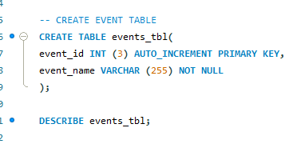
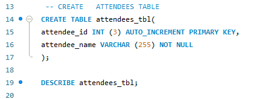
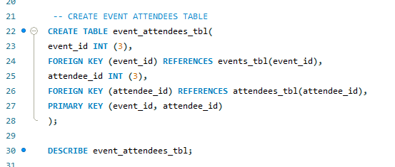
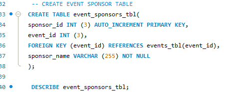

# Final Lab Task 1 : My Sql Basics-Event Management
This repository contains a set of SQL tasks to be performed using MySQL Workbench. The goal is to practice essential SQL operations such as database creation, table management, data manipulation, and querying. All tasks must be executed in MySQL Workbench and completed in the order specified to maintain proper structure and data relationships.
 
# STEP BY STEP:
these steps in order to complete Tasks 1–5 using MySQL Workbench
## Step 1: Create the Events Table
 

## Step 2: Create the Attendees table
 

## Step 3: Create the Event Attendees
 

## Step 4 : Crete the Event Sponsors 
 

 ## ER Diagram or Relational Schema  
 This diagram visually represents the relationships between the tables in the database. It shows how entities like employees, departments, and projects are linked using primary and foreign keys.

