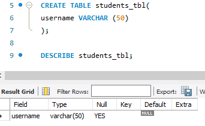
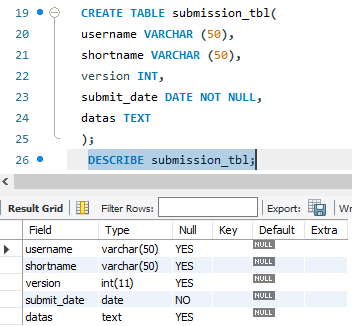

# Final Lab Task 2: Transforming ER Model to Relational Tables
 The task is to convert an ER diagram of student assignment submissions into MySQL tables by defining entities and their attributes, establishing relationships, and identifying primary and foreign keys. It also involves accurately representing any dependent or weak entities to create a normalized database schema for effective data management.

# Step by Step
 these are the Steps in order to complete the tasks usigng My SQL Workbench

# Step 1 Create the Student Table

 # Step 2  Create the Assignment Table
 

# Step 3  Create the Submission Table
 

 # ER Diagram or Relational Schema
  
 
  # SQL Copy of the Database  ->> [Student Assignment Submission](https://github.com/joy042219/EDM-portpofolio/blob/main/Final%20Lab%20Task%202/image/Sql%20copy)

