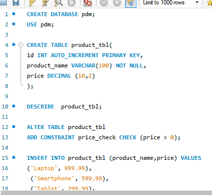

# Final Task 3: Table Manipulation
## Task Description
Designed and manipulated a MySQL table named products by creating fields with appropriate data types and constraints. Implemented a CHECK constraint to ensure positive pricing, inserted valid product data, and used ALTER statements to update the field length.
Created and modified a MySQL table called "products" with appropriate data types and constraints, including a CHECK constraint for positive pricing. Inserted valid data and adjusted field lengths using ALTER statements.

# Step 1
Create a table name products with the following field:
- id: Unique integer, auto_increment, primary key.
- product_name: String (VARCHAR) with a maximum length of 100, cannot be null
- price: Decimal.

# Task 2: 
- Add CHECK constraint to ensure that the price of the product must be greater than 0.

 # Step 3
Insert the products that will not violate the check constraint into the products table:
- Product 1: "Laptop", 999.99
- Product 2: "Headphones", -49.99
- Product 3: "Smartphone", 599.99
- Product 4: "Tablet", 299.99
- Product 5: "Monitor", -149.99
- Product 6: "Keyboard", 19.99
- Product 7: "Mouse", 14.99
- Product 8: "Desk Lamp", 24.99
- Product 9: "External Hard Drive", -79.99
- Product 10: "Speakers", 9.99

# Task 4:
Modify the poduct_name field to have the maximum lenght of 120 characters.

## ER Diagram Representation

#  Query Statement

## SQL Copy of the Database
**Download the complete SQL file here:** [Table Manipulation](https://github.com/joy042219/EDM-portpofolio/blob/main/Final%20Lab%20Task%203/copy%20of%20sql)
