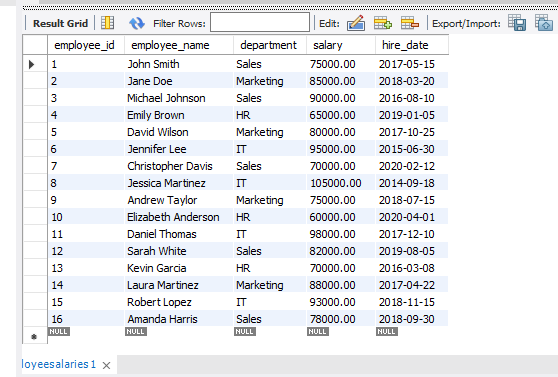
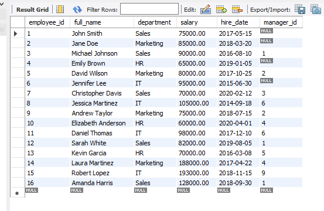

# Final Lab Task 4: Using SELECT Statement
# Task Description:
This task involved working with a single database containing two tables: EmployeeSalaries and EmployeeData. I performed a series of SELECT statements to extract and manipulate employee information.
## Problem 1. Consider a table named EmployeeSalaries that stores information about the salaries of employees. The table has the following fields:
- employee_id: INT AUTO_INCREMENT PRIMARY KEY
- employee_name: VARCHAR(100)
- department VARCHAR(50)
- salary DECIMAL(10,2)
- hire_date DATE

#### After enserting a data in the EmployeeSalaries table, perform the following SELECT statements:

- Retrieve the employee_name and salary of employees and arrange from the highest salary to the lowest.
  

- Retrieve the department names along with the average salary for each department.
   

   ## Problem 2: Consider a table named EmployeeData that stores information about employee in a company.

   1. Create a database named employeeDB, use employeeDB
   2. Copy and paste the initial query below then perform the SELECT statements required for each problems.
   
  
   #### After enserting a data in the employeeDB, perform the following SELECT statements:
 -  Retrieve the employees along with their full names and salaries from highest paying employee to the lowest.
 
  
 -  Retrieve the average salary from EmployeeData table, where the average salary exceeds $70,000.
    
  - Retrieve the full names of employees who earn a salary greater than $100,000.

   - Retrieve the number of employees from the EmployeeData table.
   -    

   ## SQL COPY
   [Query](https://github.com/joy042219/EDM-portpofolio/blob/main/Final%20Lab%20Task%204/query)
  
