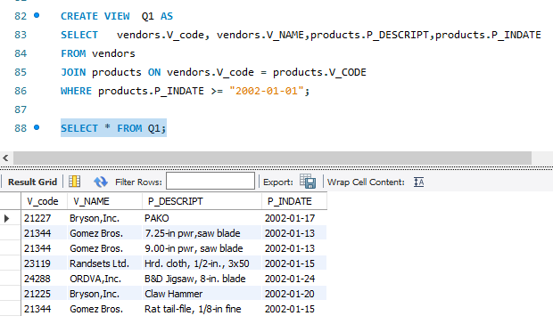
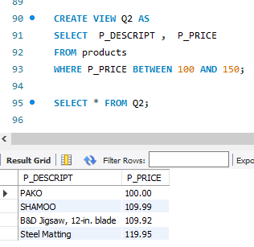
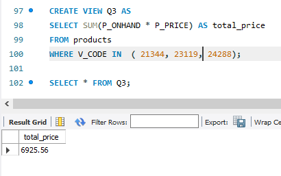
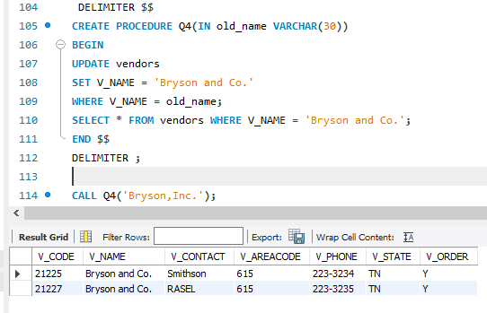
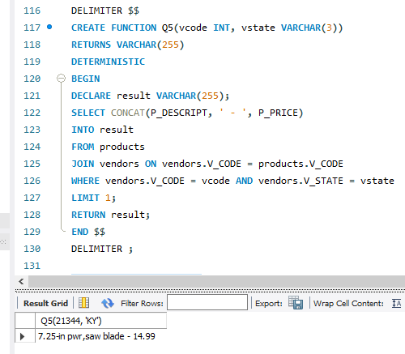

# Final Lab Task 5: Using Stored PRocedures Views and Function
### Task Description: 
This task involves working with the inventory database containing two tables: Products and Vendors. A series of Stored Procedures, Views, and Functions are created to extract and manipulate product and vendor information.

#### Instructions: 

1. To have an idea of how SQL views work, kindly read the lecture on SQL views and stored procedures, then you may try the following examples in MySQL Workbench: 
2. Start Xampp and MySQL Workbench – create or start a connection 
4. Open the democodes.sql, and you may try executing all the examples using the hrd.sql file

###  Q1. CREATE A VIEW that will display the vendors_code, vendors name, product description p_indate, of all products with p_indate from 2002 onwards
 

### Q2. CREATE a VIEW that will display all products whose price range is between 100-150

### Q3. Create a VIEW that will COMPUTE for the (TOTAL_PRICE) of ALL PRODUCTS by getting the (P_ONHAND x P_PRICE) Sold by vendors with the following v_code (21344, 23119 and 24288)

### Q4. CREATE a STORED PROCEDURE that WILL take a SINGLE PARAMETER and UPDATED the Name of Vendor ‘Bryson,Inc.’ to ‘Bryson and Co’.

### Q5. CREATE A Function that will take 2 parameters(v_code and v_state) and display All the product description and price based on the parameters passed to the function

## SQL Copy of the databases 
[Using Stored PRocedures Views and Function](https://github.com/joy042219/EDM-portpofolio/blob/main/Final%20Lab%20Task%205/image/Sql%20copy.sql)

