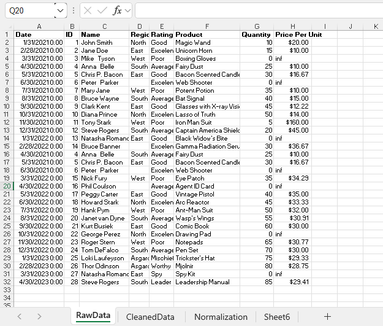
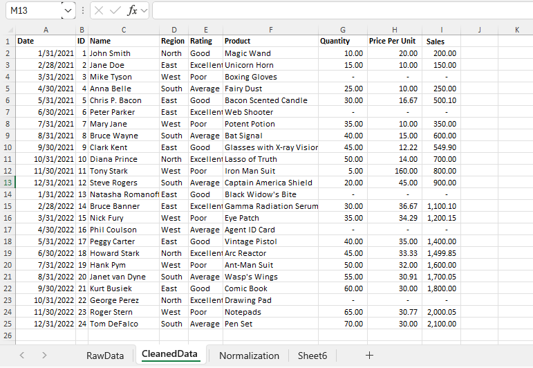

# Midterm Lab task 1 - Data Cleaning and Preparation using Excel
For this task we are given a Flat Excel (See rawfile) and we are Task to perfom Data Cleaning and Preparation

# STEP 1 Data cleaning prcess
- Load the raw file
- Fit Column and row width and height
- Trim extra spaces
- Remove NULL values
- Remove Duplicates

 # STEP 2 Normalization
  - Perform 1NF
  - Perform Table split using 2NF
  - Perform 3 NF
  - Mapped the Normalized tables as a Physical data model
 
 # STEP 3 Here's the screenshot of  my output before I started data cleaning (See screenshot)
 

# STEP 4 Here's the screenshot of my output after I started data cleaning (See screenshot) 
 

#  Here's the Physical Data Model

    
