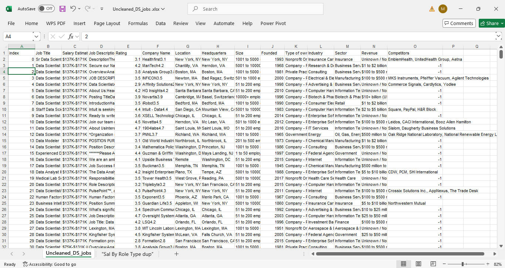
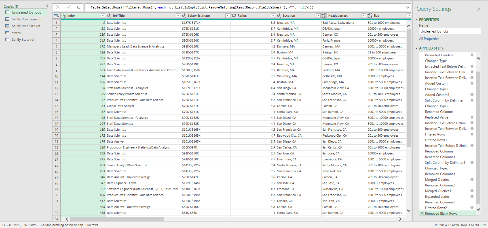
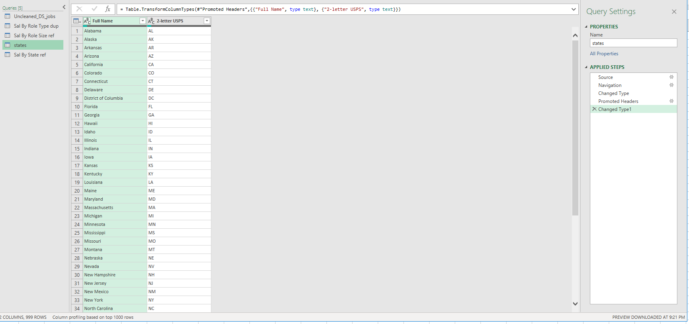

# Midterm Lab Task 2- Data Cleaning and Transformation using POWER QUERY
 The task is to clean and transform the Uncleaned_DS_Jobs.csv dataset from kaggle using power query editor in excel. The goal is to generate insights by answering these key questions:
- Which job roles pay the highest and lowest salaries?
- What size of companies offer the best salaries?
- Which job roles or titles pay the best and least in specific states?
The cleaning involves fixing salary data, classifying job roles, handling inconsistent locations, cleaning company details, and preparing the data to group by role type, company size, and state to get salary insights.

# Screenshot of the Dataset before doing Cleaning and Transformation
 
 
# Steps performed in data cleaning and transformation
## Data cleaning:

- Duplicated the raw data to preserve the original.
- Cleaned the salary estimate column by removing everything after the "(" symbol.
- Created Min Sal and Max Sal columns from the salary estimate.
- Added a new column Role Type to classify jobs as "data scientist", "data analyst", "data engineer", "machine learning engineer", or "other" based on the job title.
- Corrected the location column with custom states and split it into city and state abbreviation.
- Replaced incorrect state entries (e.g., "anne rundell" to "ma").
- Split the company size column to extract MinCompanySize and MaxCompanySize, and removed the word "employees".
- Replaced invalid or negative values:
- Competitors: replaced -1 with "n/a".
- Revenue: replaced negatives with 0.
- Industry: replaced -1 with "other".
- Cleaned company name by removing extra ratings or numbers at the end.
- Removed unnecessary columns like job descriptions.

## Data reshaping:

- Duplicated the cleaned data as Sal By Role Type dup, selected Role Type, Min Sal, and Max Sal, converted salaries to currency, multiplied by 1000, and grouped by Role Type to get average salaries.
- Created a reference as Sal By Role Size ref, selected Size, Min Sal, and Max Sal, multiplied salaries by 1000, and grouped by Size to get average salaries.
- Imported a State Mapping file to map state abbreviations to full state names and merged it with the dataset.
- Created a reference as Sal By State ref, selected State Full Name, Min Sal, and Max Sal, multiplied salaries by 1000, and grouped by State Full Name to get average salaries.
- Checked query dependencies to confirm correct relationships.
 
# Excel Ouput:
Midterm Lab Task 2: [Data Cleaning and Transformation using Power Query Editor](https://github.com/joy042219/EDM-portpofolio/tree/main/Midterm%20Task%202))

# Final output (screenshot of the final queries):

## Cleaned DS Jobs: 

## Sal By Role Type dup:

## Sal By Role Size ref:

## Sal By State:

## Sal By State ref:

## Query Dependencies:

