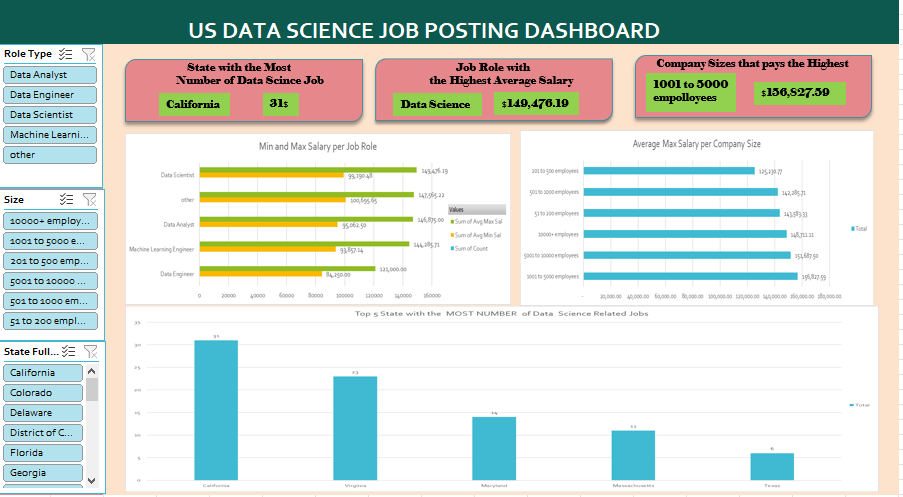

# Midterm Lab Task 3. Using Pivot Table and Create Dashboard
Create a Pivot Table-based dashboard using the provided dataset. Summarize salaries by job role, state, and company size. Design an interactive dashboard highlighting key insights using charts and slicers. Exclude the map visualization if unsupported and replace it with an alternative chart. Apply custom formatting for a polished presentation.

# Task Steps:
1. Prepared the Dataset
- I used the "Uncleaned DS Jobs" worksheet and transformed tables: Sal by Role, Sal by State, and Sal by Size.
2. Created Pivot Tables
- Generated Pivot Tables for job roles, states, and company sizes to analyze salary distribution and job counts.
3. Designed the Dashboard
- I built a dashboard highlighting:
- The state with the most Data Science jobs.
- The job role with the highest average salary.
- The company size that pays the highest.
4. Added Visualizations
- Used bar charts, column charts, or pie charts to effectively represent key insights.
5. Inserted Slicers
- I added slicers for Role Type, Company Size, and State to enhance interactivity.
6. Customized the Dashboard
- Applied design and color settings to improve visual appeal and readability.
# Final output (screenshot of the Dashboard):

